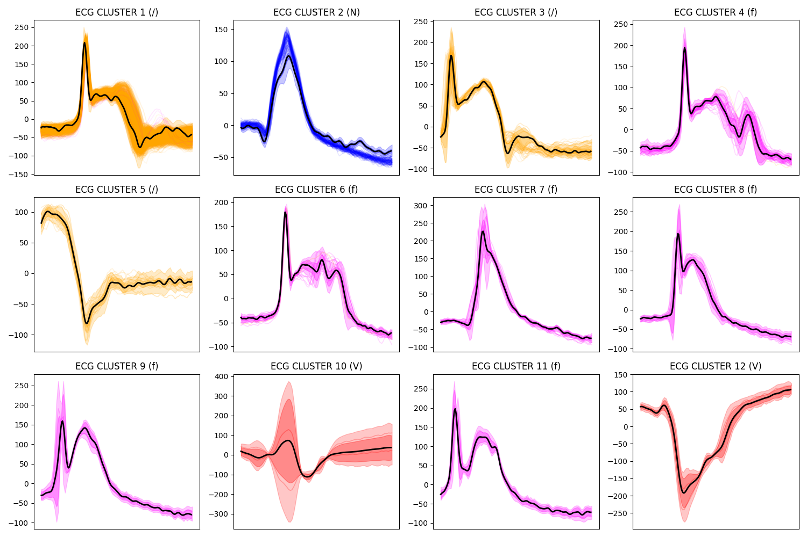

# HDP-GPC: <i>H</i>ierarchical <i>D</i>irichlet <i>P</i>rocess <i>G</i>aussian <i>P</i>rocess <i>C</i>lustering 

**Version:** v0.1.0 (November 2024)

**Authors:**
 - **Adrián Pérez Herrero**: [GitHub Profile](https://github.com/AdrianPerezHerrero) -
[Personal Page](https://citius.gal/team/adrian-perez-herrero)


The ***HDP-GPC*** package is a Python tool designed to model dynamic clustering and perform inference over time series sequences.
The model foundations are compiled in the work [Citation].

## Key Features
- **Non-parametric number of clusters:** Using a Hierarchical Dirichlet Process as prior, the number of clusters
does not have to be defined beforehand.
- **Non-parametric emission:** Based on Gaussian Process regression.
- **Parametric dynamic behaviour:** Each cluster is modelled as a Switching Linear Dynamical System allowing dynamic clustering.
- **Non-parametric alignment behaviour:** Alignment transformations can be computed between examples to deal with time-axis transformations.
- **Tailored Bayesian Variational Inference:** Inference based on the Bayesian structure of the model.
An offline scheme using a batch of data (precise and robust) and online inference (used without warp, it can deal with streaming data under some conditions).

## Installation
You can install the library from this repository as follows:
- Clone the repository and change directory:
    ```bash
    git clone https://github.com/AdrianPerezHerrero/HDP-GPC
    cd HDP-GPC
    ```
- Create a virtual environment (preferably a Conda environment):
    ```bash
    conda create -n hdpgpc_env python==3.11
    ```
- Initialize the environment:
    ```bash
    conda activate hdpgpc_env
    ```
- Install dependencies:
    ```bash
    pip install -r hdpgpc/docs/requirements.txt
    ```
- Pip install the project to use it stable:
    ```bash
    pip install .
    ```
- Or pip install the project in an editable state to edit the code:
    ```bash
    pip install -e .
    ```
    
## Usage

Data extracted from the public MIT-BIH Arrhythmia Database [1] is included.
This data comprises each beat in the record segmented using the database-included annotations. 
- Run online clustering with the selected record:
    ```bash
    python hdpgpc/tests/test_online.py 100
    ```
- Run offline clustering with the selected record:
    ```bash
    python hdpgpc/tests/test_offline.py 100
    ```
- Revise a step-by-step usage in the Jupiter Notebook in
    ```bash
    hdpgpc/tests/test_step.jpy
    ```

## Results

The clusters can be plotted using the util_plots.py class in the results folder. As an example:



## License
This project is licensed under the terms of the **GNU General Public License v3.0** (*GPLv3*) - see the LICENSE file 
for details.

## References
1. Goldberger, A., Amaral, L., Glass, L., Hausdorff, J., Ivanov, P. C., Mark, R., ... & Stanley, H. E. (2000).
PhysioBank, PhysioToolkit, and PhysioNet: Components of a new research resource for complex physiologic signals.
Circulation [Online]. 101 (23), pp. e215–e220.
